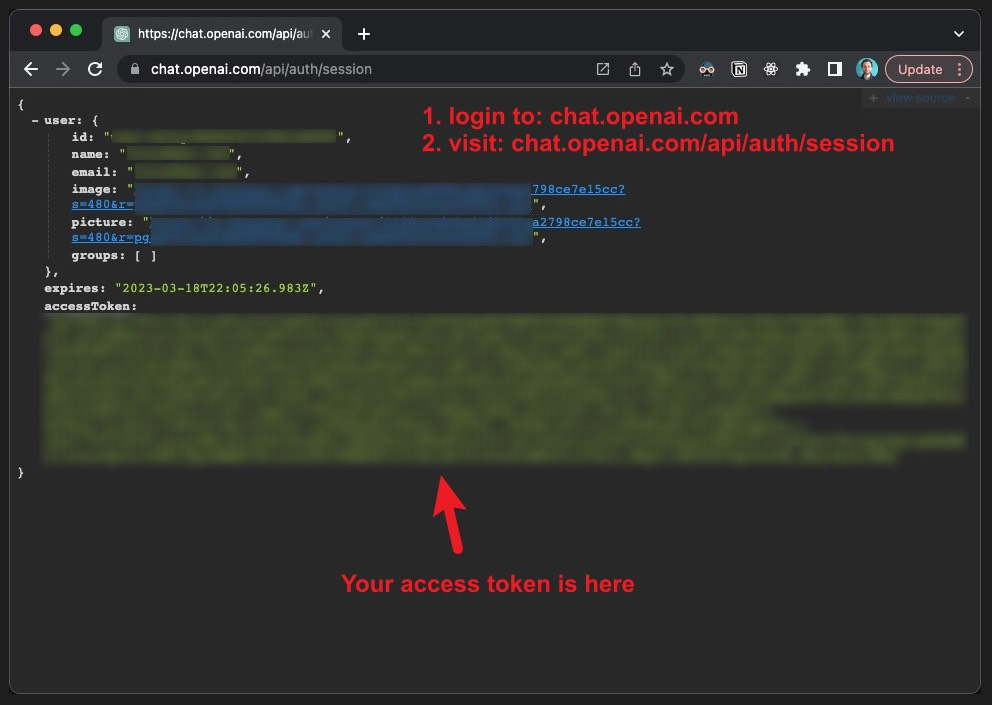
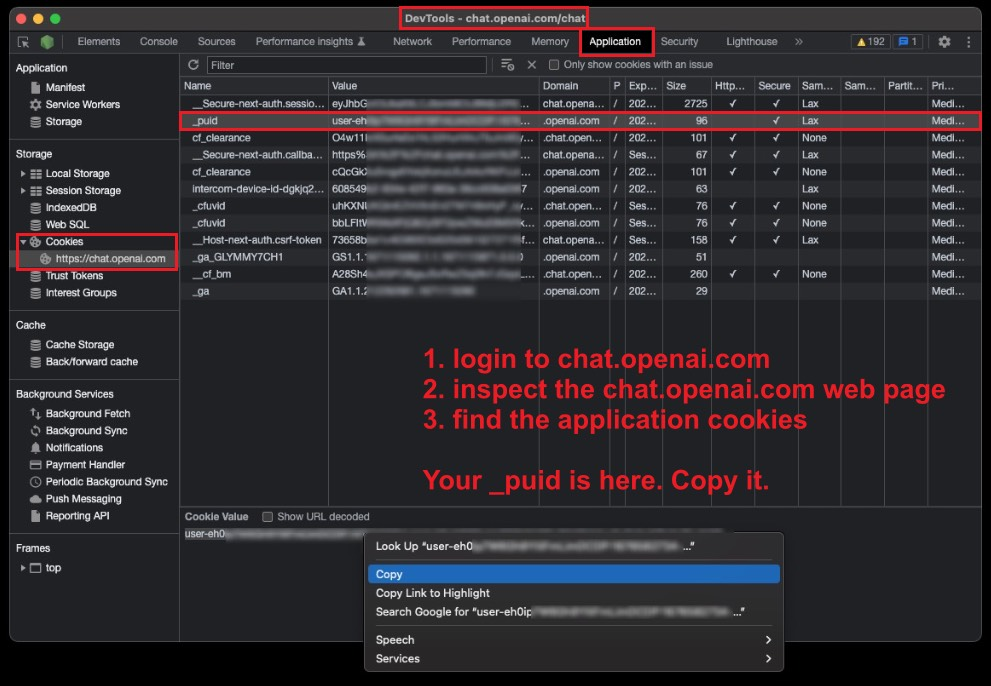

# ChatGPT

Let's chat with ChatGPT.

To start using this extension, you need to login to [chat.openai.com](https://chat.openai.com).

Then find your `accessToken` and `_puid`:

### accessToken

### _puid

